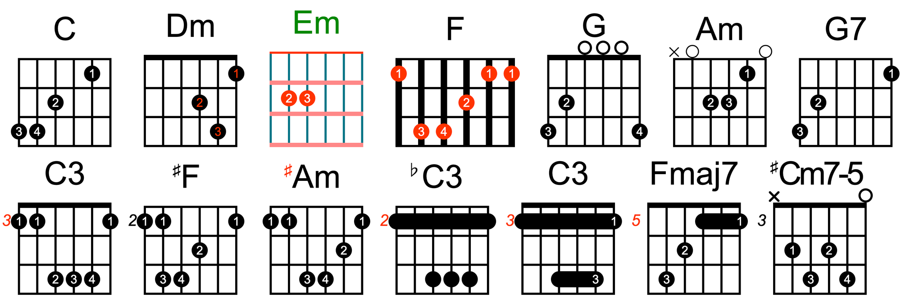

# guitar-chords

Generate and edit guitar chord diagrams in Canvas or SVG. [View the chord diagrams it generates →](https://capricorncd.github.io/guitar-chords/playground/).

```js
import { GuitarChords } from '@guitar-chords/canvas'
// import { GuitarChords } from '@guitar-chords/svg'

const guitarChords = new GuitarChords({
  name: 'C',
  matrix: [
    [0, 0, 0, 0, 1, 0],
    [0, 0, 2, 0, 0, 0],
    [3, 4, 0, 0, 0, 0],
  ],
})
// get canvas element and append to body
document.querySelect('body').append(guitarChords.element)
// get data
console.log(guitarChords.data)
```



## @guitar-chords/canvas

See [libs/canvas](./libs/canvas), README [English](./libs/canvas/README.md) - [中文](./libs/canvas/README_CN.md)

## @guitar-chords/svg

See [libs/svg](./libs/svg), README [English](./libs/svg/README.md) - [中文](./libs/svg/README_CN.md)

## @guitar-chords/editor

TODO
